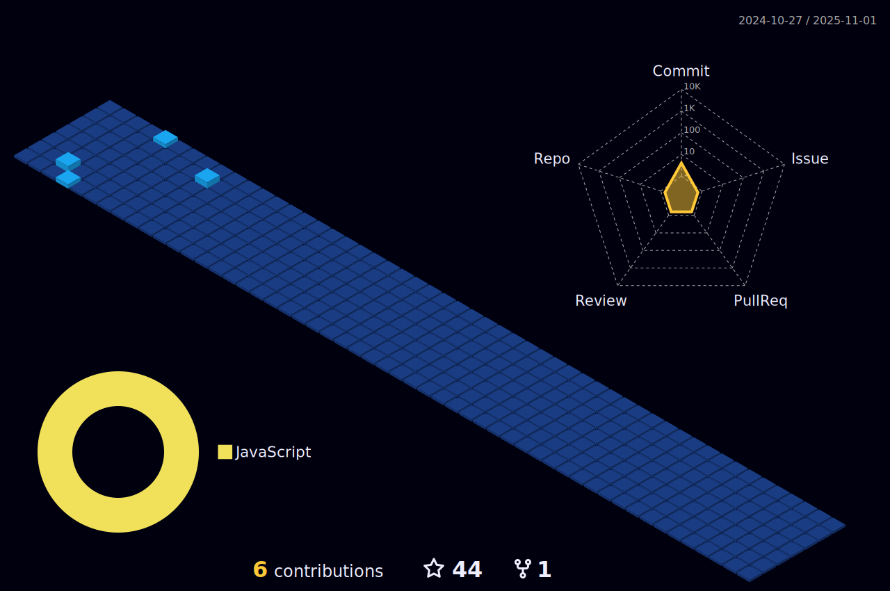

# 💫 About Me:
🔭 I’m currently working on ReactJS 👯 I’m looking to collaborate on Full Stack App Projects 🌱 I’m currently learning ReactJS 💬 Ask me about Web Designing and CP ⚡ Fun fact, I can solve 3*3 Rubik's Cube under 1 min

## 🌐 Socials:
  

# 💻 Tech Stack:
          
# 📊 GitHub Stats:
 
 

 
 

 
 

### ✍️ Random Dev Quote

---

<!-- Proudly created with GPRM ( https://gprm.itsvg.in ) -->
